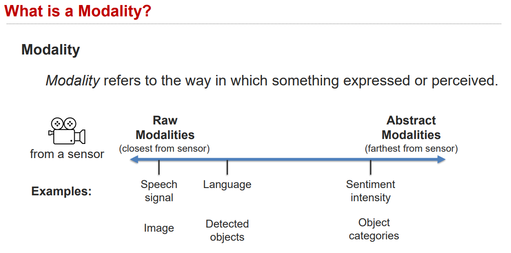
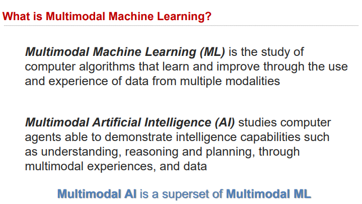

# Lecture 1.1: Introduction to Multimodal Machine Learning

[refer](https://piazza.com/class_profile/get_resource/l7azp3o09q267p/l7fe47r6mdc6ja)

## what is multimodal?

more abstract, the close those features will be :thinking:, Abstract modalities are more likely to be homogeneous

In short, multimodal is the science of **heterogeneous** and **interconnected** data.

### dimensions of heterogeneity

- elem wise: a image can be seemed as a *list* of objects
- elem distribution: density, frequency
- structure: temporal, spatial, hierarchical, latent, explicit ...
- information: abstraction (eg, describe the whole room in a few words), entropy
- noise: uncertainty, signal-to-noise ratio (like typos), missing data 
- relevance: task relevance, context dependence; maybe two modalities are not relevant to each other, and their tasks are not related

### Interconnectedness
1. different modalities can be connected 
   1. because they have related and shared commonality
   2. from a stat view: can be seemed as association/correlation/co-occurrence, or dependence(eg causal/temporal)
   3. from a semantic view: this is because they have the same ground truth/correspondence, or function (eg xx used xxx for yyyy)

2. Interactions only happens during inference

## core technical and conceptual challenges 
in the context  of MML, MMAI is the superset of MML:

## schedule
together, we will solve **6 challenges** along those roads

