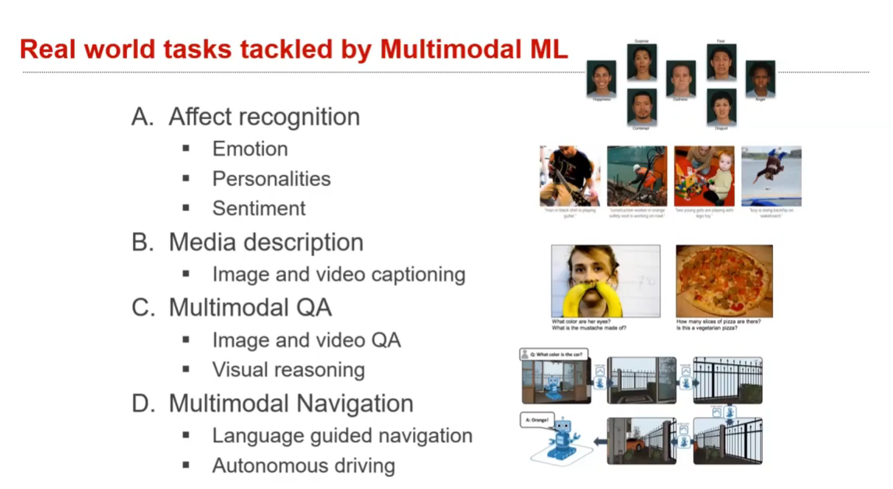
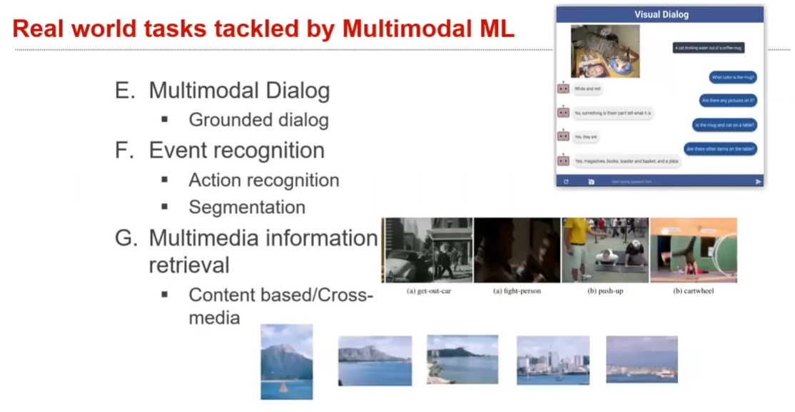
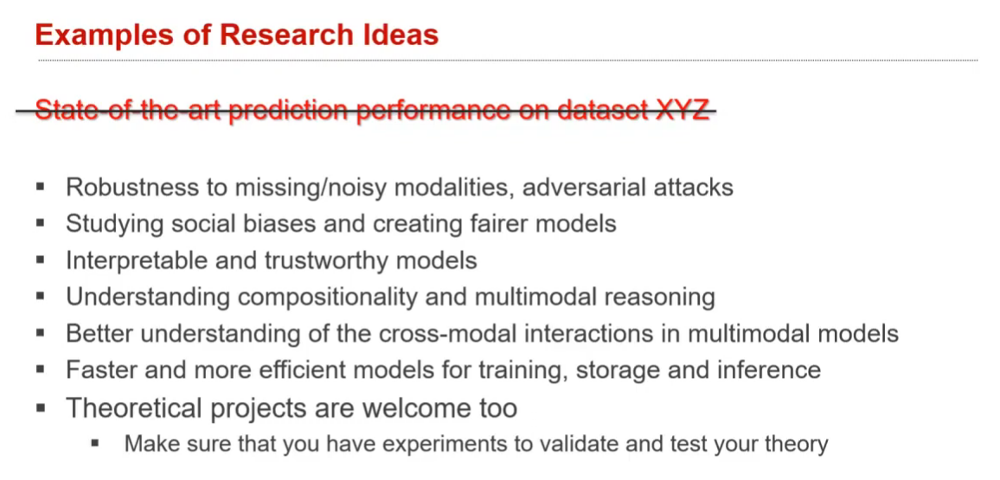

# Lec 1.2: Multimodal Research Tasks

## Course syllabus and projects assignments

tasks:
- after reading the paper, created a short summary of the paper to help others
- read other's summaries, ask questions
- write *follow-up* posts comparing the papers and suggesting ideas, at least one!

it is ok to be worse than the baseline, as long as you can figure out *why*

## historical review of multimodal tasks

- behavior ages
  - `ba` `fa` 
- Computational era
- deep learning era :laughing:

## Experiment design

the ways to think of ideas are impressive

else ideas are in the HeartJourney :laughing:

## mm datasets and research tasks

see the course appendix for more details

MSCOCO

VQA, all kinds of 'X'QA 

Room2Room
## previous course projects

