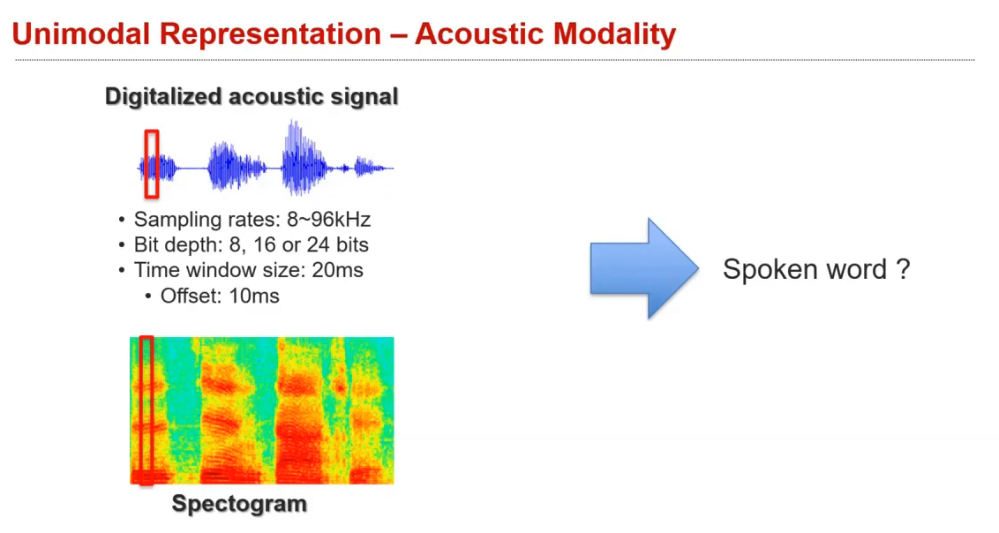
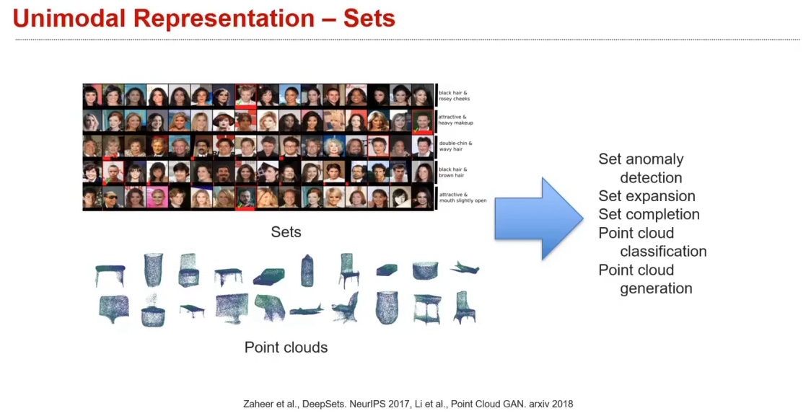
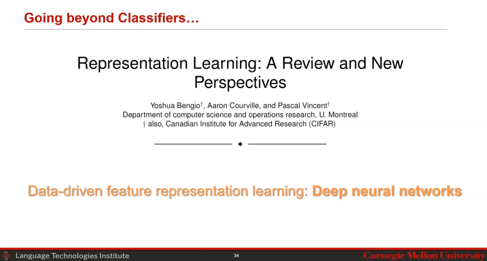

# Lec 2.1: Basic concepts

## Unimodal Representation
### Visual

### Language

### Acoustic 
do it with *fft* transformation, end up having a 2D representation (*image*) of the sound wave, but do not have the **translational invariance property**.

### sensor and tactile, six-axis motion sensing, Graphs, Sets

- Making Sense of Vision and Touch: Self-Supervised Learning of Multimodal Representations for Contact-Rich Tasks, ICRA 2019

When using CNN, ask the question: "**What invariance naturally exists?**"

In fact, using KNN dealing with MM works not bad, as long as finding a good representation of the Nearest Neighbors.

## Learning Representations
if got a good representation, then do not need to use complex model in feature fusion :thinking: —— garbage in, garbage out.

a lot of research nowadays, is about putting the insight into the model / data / regulation, which allows to use just a simple architecture

## intro to NN
