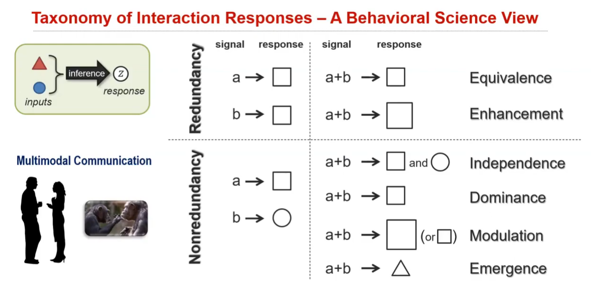
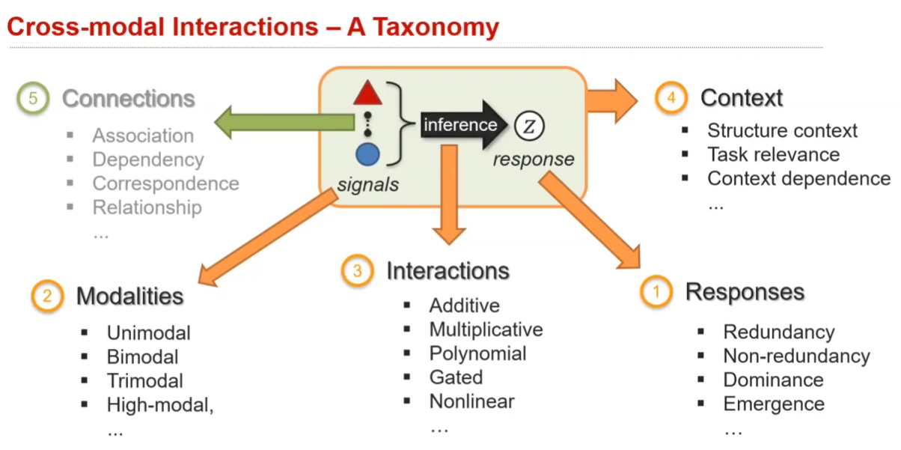
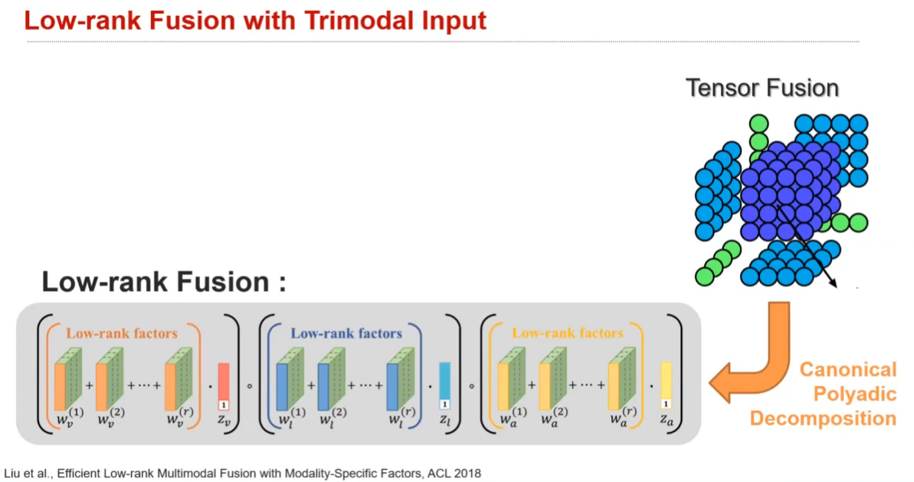
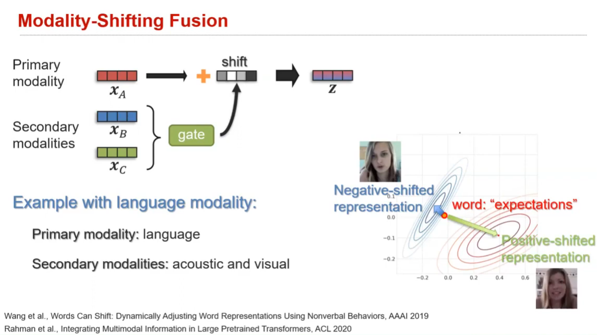
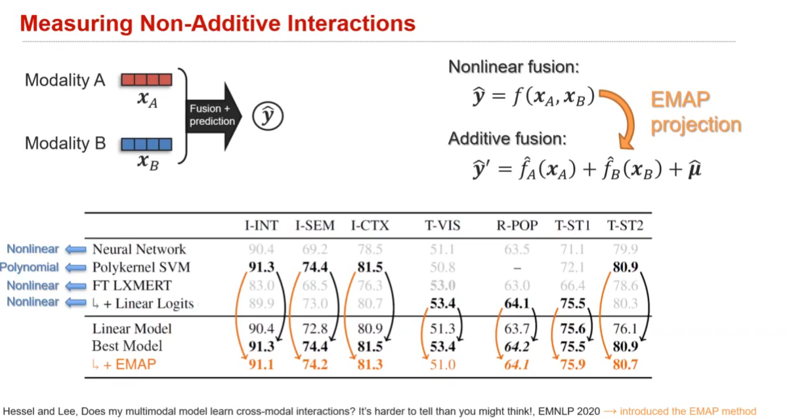

# MMR: Multi-Modal Representation

Finally, we can begin to talk about the MMR model.

## Fusion
### taxonomy of interaction responses
from the cognitive science view

the whole aspects of cross-modal interaction 

### with multi-modal encoders

- early fusion
  - use concatenation to agg the features before downstream tasks
- late fusion
  - agg downstream tasks

how to fuse the features? $x_A$ + $x_B$ = $z$
$$
[\cdot||\cdot] \quad \text{concatenation} \\
z = f_1(x_1) + f_2(x_2) \quad \text{additive fusion} \\
z = f(x_1 \times x_2) \quad \text{multiplicative fusion} \\
z = f(x_1^T \cdot x_B) \quad \text{bilinear multiplication fusion (do not need align)} \\
$$

for simple fusion. need to align the features space first, like the channel dimension

- tensor fusion

also refer to the paper:
 
NIPS 2019 Deep Multimodal Multilinear Fusion with Higher-order Polynomial Pooling

- Gated fusion

attention is just another term for gating :astonished:

- modality-shifting fusion

- dynamic fusion
  - here, using all the fusion strategies and then gated (with *hard* or soft attention)

- Nonlinear fusion
just use a neural network like MLP to project features into a common space

however, most fusion seems like just additive interactions :thinking:

