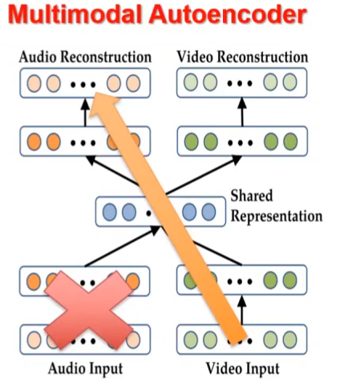

# MMR II

we are now at the challenge 1: representation, with 3 sub-challenges: Fusion, coordination, fission

## Learning fusion representation

a simple mm AE, but can lead to zero-shot learning :thinking:

## fusion with raw modalities

refer to : On the benefits of early fusion in multimodal representation learning arXiv 2022

